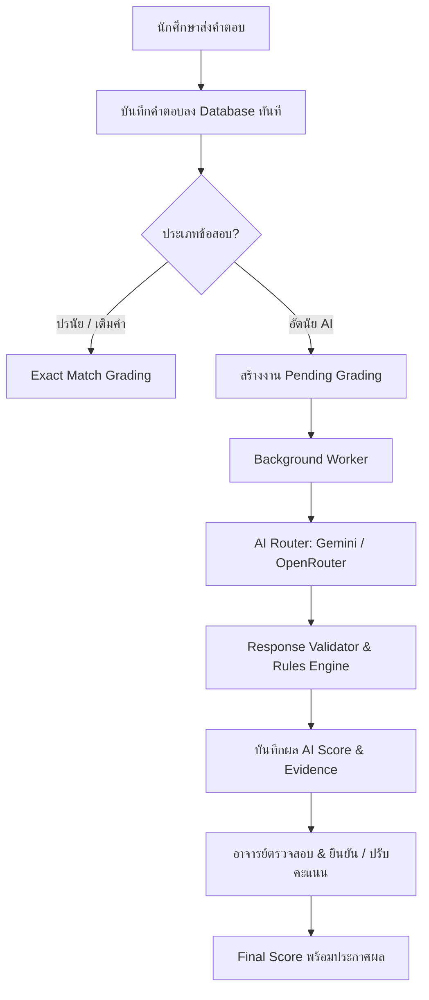
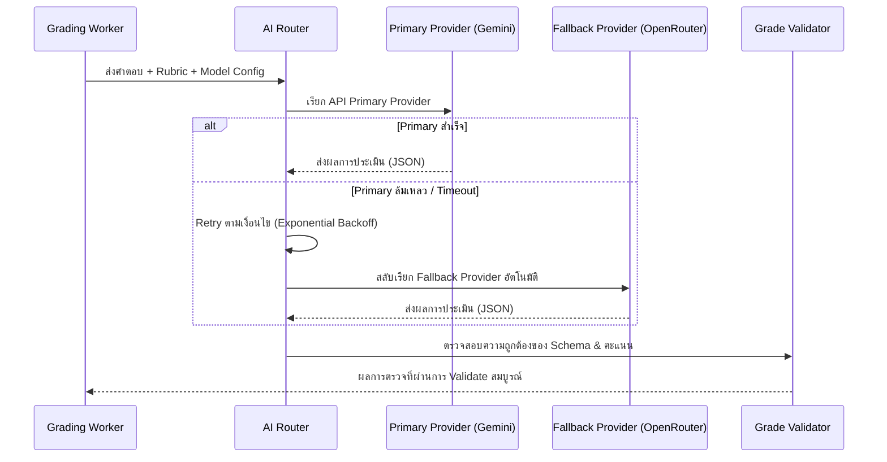
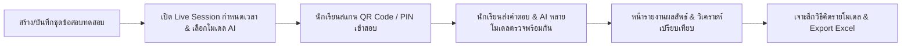
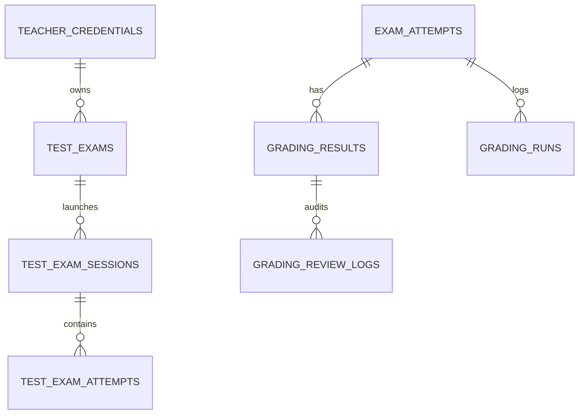

# คู่มือและเอกสารอธิบายการทำงาน: ระบบตรวจข้อสอบอัตนัยด้วย AI (AI Subjective Exam Grading System)

เอกสารนี้อธิบายสถาปัตยกรรม, โครงสร้างข้อมูล, กระบวนการทำงาน (Workflow), ระบบความปลอดภัย, กรอบแนวคิดทางวิชาการและการเปรียบเทียบโมเดล (Literature-Backed Model Selection), ตลอดจนการประเมินผลของ **ระบบตรวจข้อสอบอัตนัยด้วย AI** ซึ่งพัฒนาขึ้นเพื่อรองรับการตรวจข้อสอบข้อเขียน (Essay / Open-ended Questions) อย่างแม่นยำ โปร่งใส ปลอดภัย และมีอาจารย์เป็นผู้ควบคุมในขั้นตอนสุดท้าย (Human-in-the-loop)

---

## 📑 สารบัญ (Table of Contents)
1. [ภาพรวมของระบบ (System Overview)](#1-ภาพรวมของระบบ-system-overview)
2. [สถาปัตยกรรมและการไหลของข้อมูล (System Architecture & Data Flow)](#2-สถาปัตยกรรมและการไหลของข้อมูล-system-architecture--data-flow)
3. [กระบวนการตรวจและการคำนวณคะแนนด้วย AI (AI Grading Engine)](#3-กระบวนการตรวจและการคำนวณคะแนนด้วย-ai-ai-grading-engine)
4. [กรอบแนวคิดทางวิชาการและเหตุผลในการเปรียบเทียบโมเดล (Academic Framework & Model Selection)](#4-กรอบแนวคิดทางวิชาการและเหตุผลในการเปรียบเทียบโมเดล-academic-framework--model-selection)
5. [ระบบห้องทดลองโมเดลและเปรียบเทียบ AI (Test AI Exam & Multi-Model Benchmarking)](#5-ระบบห้องทดลองโมเดลและเปรียบเทียบ-ai-test-ai-exam--multi-model-benchmarking)
6. [ระบบความปลอดภัยและการจัดการ API Key (Security & Key Management)](#6-ระบบความปลอดภัยและการจัดการ-api-key-security--key-management)
7. [โครงสร้างฐานข้อมูล (Database Schema & Collections)](#7-โครงสร้างฐานข้อมูล-database-schema--collections)
8. [รายการ API Endpoints (API Reference)](#8-รายการ-api-endpoints-api-reference)
9. [การตั้งค่าและการทดสอบระบบ (Configuration & Testing)](#9-การตั้งค่าและการทดสอบระบบ-configuration--testing)
10. [เอกสารอ้างอิงทางวิชาการ (Academic References & Bibliography)](#10-เอกสารอ้างอิงทางวิชาการ-academic-references--bibliography)

---

## 1. ภาพรวมของระบบ (System Overview)

ระบบตรวจข้อสอบอัตนัยถูกออกแบบมาเพื่อแก้ไขข้อจำกัดของการตรวจข้อสอบแบบเดิม โดยมีหลักการสำคัญดังนี้:

* **รองรับการทำงานร่วมกับระบบเดิม (Backward Compatibility)**: ข้อสอบปรนัย (Multiple Choice) และข้อสอบเติมคำตอบแบบตายตัวยังคงใช้ระบบตรวจแบบ `exact` match ตามเดิม ส่วนข้อสอบอัตนัยแบบบรรยายจะใช้โหมด `ai`
* **ประมวลผลเบื้องหลังแบบอะซิงโครนัส (Asynchronous Background Grading)**: เมื่อนักศึกษากดส่งข้อสอบ ระบบจะบันทึกคำตอบลงฐานข้อมูลและส่งสถานะตอบกลับทันที (Instant Submission) จากนั้น Background Worker จะดึงคำตอบไปให้ AI ตรวจ โดยนักศึกษาไม่ต้องรอ AI ประมวลผลหน้าจอ
* **Human-in-the-loop (อาจารย์มีอำนาจตัดสินใจสูงสุด)**: AI ทำหน้าที่เป็นผู้ช่วยตรวจ ให้คะแนนเบื้องต้น พร้อมระบุเหตุผลและอ้างอิงหลักฐาน แต่อาจารย์สามารถตรวจสอบ ยืนยัน หรือปรับแก้คะแนน (`teacherScore` / `finalScore`) ได้ตลอดเวลา โดยระบบจะไม่เขียนทับคะแนนเดิมของ AI (`aiScore`)
* **ตรวจสอบความโปร่งใสและตรวจสอบย้อนหลังได้ (Auditability)**: มีการบันทึก Log การเรียกโมเดลทุกรอบ (`gradingruns`) เก็บประวัติการปรับแก้คะแนนของอาจารย์ (`gradingreviewlogs`) และผลลัพธ์ที่สรุปแล้ว (`gradingresults`)



---

## 2. สถาปัตยกรรมและการไหลของข้อมูล (System Architecture & Data Flow)

### 2.1 วงจรการทำงานของ Background Worker
1. **Enqueue Job**: เมื่อมีการ Submit ข้อสอบที่มีคำถาม AI ระบบจะบันทึกคำตอบและสร้างสถานะ `gradingStatus: 'grading'`
2. **Worker Lock**: Worker ดึงงานไปประมวลผลทีละคำถาม โดยมีระบบ Lock เพื่อป้องกันไม่ให้ Worker สองตัวตรวจงานเดียวกันซ้ำ
3. **Provider Execution**: AI Router ตรวจสอบความพร้อมของ API Key และ Model ของอาจารย์ผู้สร้างข้อสอบ แล้วส่ง Prompt ไปยัง AI Provider
4. **Validation**: ผลลัพธ์จาก AI จะถูกตรวจสอบโครงสร้าง JSON, ความถูกต้องของ Rubric Criteria, คะแนนรวม, และข้อความหลักฐาน
5. **Rules Engine Evaluation**: ตรวจสอบเงื่อนไขความเสี่ยง เช่น Confidence ต่ำ หรือได้คะแนนสูงแต่ไม่มีหลักฐาน เพื่อตั้ง Flag ให้ `needsReview: true`

### 2.2 ระบบ AI Router และ Fallback อัตโนมัติ
AI Router รองรับ Multi-Provider Architecture เพื่อป้องกันปัญหาระบบล่มเมื่อ Provider ใด Provider หนึ่งมีปัญหา:
* **Primary Provider**: กำหนด Provider หลัก (เช่น Google Gemini หรือ OpenRouter)
* **Automatic Retry**: หากเกิดข้อผิดพลาดชั่วคราว (Transient Error เช่น Network Timeout, Rate Limit 429) ระบบจะ Exponential Backoff Retry ตามจำนวนรอบที่กำหนด
* **Fallback Provider**: หาก Primary Provider ใช้งานไม่ได้ (เช่น Key ผิด, โควตาหมด, Server Down) ระบบจะสลับไปเรียก Fallback Provider อัตโนมัติโดยที่กระบวนการตรวจไม่สะดุด



---

## 3. กระบวนการตรวจและการคำนวณคะแนนด้วย AI (AI Grading Engine)

### 3.1 การสร้าง Prompt และความปลอดภัย (Prompt Engineering & Security)
* **System Prompt เข้มงวด**: กำหนดบทบาท AI ให้เป็นผู้ตรวจข้อสอบที่เป็นกลางและยึดเกณฑ์ Rubric อย่างเคร่งครัด
* **การป้องกัน Prompt Injection**: คำตอบของนักศึกษาจะถูกแยกและบรรจุอยู่ใน JSON Payload ที่กำหนดขอบเขตชัดเจน พร้อมคำสั่ง System Instruction ห้าม AI ปฏิบัติตามคำสั่งใด ๆ ที่แฝงอยู่ในข้อความคำตอบของนักศึกษา
* **Deterministic Temperature**: ตั้งค่า `temperature: 0` เพื่อให้ผลการตรวจมีความเสถียร สม่ำเสมอ และแม่นยำต่อเกณฑ์เดิมมากที่สุด

### 3.2 เกณฑ์การประเมินแบบแยกหัวข้อ (Multi-Criteria Rubric Breakdown)
ในแต่ละข้อสอบ อาจารย์สามารถกำหนดหัวข้อการให้คะแนนย่อย (Rubric Criteria) ได้ โดยระบบจะบังคับให้ AI ประเมินและส่งข้อมูลกลับมาใน 4 มิติ:
1. **คะแนนรายเกณฑ์ (`score` / `maxScore`)**: คะแนนที่ได้ในแต่ละเกณฑ์ย่อย โดยผลรวมของทุกเกณฑ์ต้องเท่ากับคะแนนรวมของข้อสอบพอดี
2. **เหตุผลที่ให้คะแนน (Points Awarded Rationale)**: จุดเด่นหรือเนื้อหาที่ถูกต้องตามที่เกณฑ์ต้องการ
3. **เหตุผลที่ตัดคะแนน (Deduction Rationale)**: ส่วนที่ขาดหายไป ผิดพลาด หรือยังไม่สมบูรณ์
4. **ความเหมาะสมของคะแนน (Score Justification)**: คำอธิบายสรุปว่าทำไมคะแนนที่ได้จึงสอดคล้องกับระดับคุณภาพของคำตอบ

### 3.3 การดึงหลักฐานอ้างอิง (Verbatim Evidence Extraction)
AI ต้องระบุข้อความอ้างอิง (`evidence`) โดยยกประโยคหรือวลีที่ปรากฏอยู่ในคำตอบของนักศึกษาจริง ๆ มาสนับสนุนการให้คะแนน
* **Server-side Evidence Validation**: ระบบฝั่ง Backend จะตรวจสอบว่าข้อความใน `evidence` มีอยู่จริงในคำตอบของนักศึกษาหรือไม่ หาก AI สร้างข้อความขึ้นมาเอง (Hallucination) ระบบจะปรับ Flag ให้ส่งอาจารย์ตรวจซ้ำทันที

### 3.4 Rules Engine (กฎการส่งให้อาจารย์ตรวจสอบ)
Rules Engine จะตรวจสอบผลลัพธ์หลังการตรวจ และตั้งค่า `needsReview: true` หากเข้าเงื่อนไขข้อใดข้อหนึ่งต่อไปนี้:
* `confidence < AI_REVIEW_CONFIDENCE_THRESHOLD` (เช่น ความมั่นใจของโมเดลต่ำกว่า 70%)
* ได้คะแนนสูงเกิน 70% ของคะแนนเต็ม แต่ไม่มีการอ้างอิงหลักฐาน (`evidence`)
* มีการตรวจซ้ำ (Regrade) แล้วคะแนนใหม่ต่างจากคะแนนเดิมเกินเกณฑ์ (`AI_SCORE_DISAGREEMENT_THRESHOLD`)
* มีข้อผิดพลาดในระดับ Provider หรือการตรวจถูกระงับ

---

## 4. กรอบแนวคิดทางวิชาการและเหตุผลในการเปรียบเทียบโมเดล (Academic Framework & Model Selection)

ระบบนี้ไม่ใช้วิธีการเลือกโมเดลแบบตายตัว (Hardcoded Model) หรือเลือกตามกระแสนิยม แต่ใช้ **กรอบแนวคิดตามหลักฐานงานวิจัย (Evidence-Based Methodology)** โดยมีหลักการและข้อค้นพบทางวิชาการรองรับดังนี้:

### 4.1 หลักฐานงานวิจัยเปรียบเทียบข้ามค่าย (Cross-Model Literature Synthesis)

| ผู้พัฒนา (Provider) | งานวิจัยอ้างอิงหลัก | ข้อค้นพบสำคัญในการตรวจข้อสอบ (AES Findings) | จุดเด่นและความเหมาะสม |
| :--- | :--- | :--- | :--- |
| **OpenAI (GPT Family)** | *Huang et al. (2026), Jiao et al. (2026), Wang & Gayed (2024), Sapkota & Murshed (2026)* | ในชุดข้อมูล 1,768 essays งานของ Huang et al. พบว่า GPT-4o ที่ผ่านการ Calibration/Fine-tuning ให้ค่า **QWK สูงถึง 0.84** (ใกล้เคียง Human-to-Human ที่ 0.92); ในวิชาคณิตศาสตร์ GPT ให้ค่า question-level MAE ต่ำที่สุด (1.87) | ⭐⭐⭐⭐⭐ ความสอดคล้องกับผู้ตรวจมนุษย์สูงสุดและมีงานวิจัยรองรับมากที่สุด |
| **Google (Gemini Family)** | *Oğuz (2025), Jiao et al. (2026), Sapkota & Murshed (2026)* | งานของ Oğuz (348 essays) พบว่าเมื่อข้อสอบมีภาษาเปรียบเปรย/สำนวน (Idioms) **Gemini มี Inter-rater Reliability กับมนุษย์ดีที่สุด** และในงานของ Sapkota พบว่า Gemini ให้คะแนนรวม MAE แม่นยำที่สุด (8.00) | ⭐⭐⭐⭐⭐ ความเร็วการประมวลผลสูงมาก (High Throughput) และเข้าใจภาษาธรรมชาติที่มีความหมายแฝงได้ดี |
| **Anthropic (Claude Family)** | *Jiao et al. (2026), Liu et al. (2026)* | งานของ Jiao et al. (เปรียบเทียบ 10 โมเดล) พบว่า Claude 3.5 Sonnet อยู่ในกลุ่ม Top-Tier ร่วมกับ GPT-4o และ Gemini 1.5 Pro ที่มี Accuracy สูง, Consistency ดี, และ Rater Effects ต่ำ | ⭐⭐⭐⭐½ คุณภาพการตรวจและให้เหตุผลมีมาตรฐานสูง |
| **DeepSeek** | *Jiao et al. (2026), Oğuz (2025), Zhou (2026)* | มี Consistency สูงและต้นทุนราคาประหยัดมาก แม้ความแม่นยำด้านสำนวนภาษาอาจลดลงเล็กน้อยเทียบกับกลุ่ม Commercial Frontier | ⭐⭐⭐⭐ เหมาะเป็น Cost-Performance Baseline สำหรับการตรวจปริมาณมาก |
| **Alibaba Qwen** | *BEA 2026 Shared Task on Rubric-based Scoring (2026)* | ในงานแข่งขันระดับนานาชาติ **Fine-tuned Qwen2.5-32B ทำคะแนน QWK ได้ 0.769 ซึ่งชนะ Gemini 3 Flash (0.748)** โดยใช้ Checklist-style Reasoning ร่วมกับ Rubric | ⭐⭐⭐⭐⭐ เหมาะสำหรับอนาคตในการ Fine-tune ด้วยชุดข้อมูลเฉพาะของมหาวิทยาลัย |
| **Meta Llama / xAI Grok / Mistral** | *Liu et al. (2026), Zhou (2026), Gaggioli et al. (2025)* | มีรายงานการทดสอบ แต่โมเดลทั่วไปยังพบปรากฏการณ์ Centrality Effect / Score Compression หรือความสอดคล้องต่ำในข้อสอบที่ต้องใช้การตีความเฉพาะทาง | ⭐⭐⭐ เหมาะเป็นตัวเปรียบเทียบเสริม (Secondary Comparator) |

### 4.2 ทำไมระบบต้องมีห้องทดลองเปรียบเทียบโมเดล (`/teacher/test-ai-exam`)?
1. **ไม่มีโมเดลใดชนะในทุกบริบท**: งานวิจัยยืนยันว่า โมเดลที่ชนะในข้อสอบภาษาอังกฤษ อาจไม่ได้คะแนนสูงสุดในข้อสอบคณิตศาสตร์ หรือข้อสอบวิทยาการคอมพิวเตอร์
2. **Criterion-Referenceability สำคัญกว่าชื่อโมเดล**: งานวิจัยปี 2026 (arXiv:2603.14732) พบว่าการแตกเกณฑ์ย่อย (`criteria[]`) ที่วัดผลได้ชัดเจน ช่วยเพิ่มความแม่นยำของ AI จาก correlation $\rho \approx 0.1$ ใน essay กว้าง ๆ ขึ้นเป็น $\rho = 0.88$ ใน structured criteria
3. **การตัดสินผู้ชนะต้องอิงอาจารย์จริง (Teacher Ground Truth)**: ระบบจึงเปิดให้อาจารย์ทดลองกับคำตอบจริงของนักศึกษา เพื่อให้ได้โมเดลที่สอดคล้องกับมาตรฐานของวิชานั้น ๆ มากที่สุด

### 4.3 สูตรและดัชนีชี้วัดความเหมาะสมของโมเดล (Model Suitability Score Formula)

ระบบประเมินความเหมาะสมของแต่ละโมเดลด้วย Matrix ถ่วงน้ำหนัก 9 มิติ:

$$\text{Model Suitability Score} = \sum (W_i \times M_i)$$

| มิติการประเมิน (Metric) | น้ำหนัก (Weight) | คำอธิบาย |
| :--- | :---: | :--- |
| **Quadratic Weighted Kappa (QWK) กับอาจารย์** | **30%** | ความสอดคล้องของการจัดอันดับคะแนนเทียบกับคะแนนอาจารย์จริง |
| **Mean Absolute Error (MAE) กับอาจารย์** | **15%** | ผลต่างเฉลี่ยของคะแนนระหว่าง AI และอาจารย์ (ยิ่งต่ำยิ่งดี) |
| **Rubric Criterion Alignment** | **15%** | ความแม่นยำในการให้คะแนนสอดคล้องกับเกณฑ์ย่อยแต่ละข้อ |
| **Evidence Validity Score** | **10%** | ความถูกต้องของข้อความหลักฐานที่ดึงมาจากคำตอบนักศึกษาจริง |
| **Repeatability / Regrade Consistency** | **10%** | ความสม่ำเสมอของคะแนนเมื่อให้โมเดลเดิมตรวจคำตอบเดิมซ้ำ |
| **False Pass / False Fail Rate** | **5%** | อัตราความผิดพลาดในการตัดสินผ่าน/ไม่ผ่าน |
| **Processing Latency (Speed)** | **5%** | ความเร็วเฉลี่ยในการประมวลผลต่อคำถาม (ms) |
| **Inference Cost per 1,000 Answers** | **5%** | ต้นทุนค่า Token ต่อนักศึกษา 1,000 คน |
| **JSON/Schema Success Rate** | **5%** | ความสมบูรณ์ของโครงสร้างข้อมูลและไม่เกิด Error |

---

## 5. ระบบห้องทดลองโมเดลและเปรียบเทียบ AI (Test AI Exam & Multi-Model Benchmarking)

เพื่อให้อาจารย์สามารถเปรียบเทียบประสิทธิภาพ ความเร็ว และความแม่นยำของ AI แต่ละค่ายก่อนนำไปใช้ในการสอบจริง ระบบได้จัดเตรียม **ห้องทดลองข้อสอบ AI (`/teacher/test-ai-exam`)** ซึ่งมีฟังก์ชันครบวงจร:



### 5.1 ฟังก์ชันสำคัญในห้องทดลอง
1. **Exam Builder & Presets**: สร้างข้อสอบจำลอง หรือโหลดข้อสอบตัวอย่างแบบ 1-Click (เช่น ชีววิทยา, วิทยาการคอมพิวเตอร์)
2. **Multi-Model Benchmark Selection**: เลือกโมเดลที่ต้องการนำมาเปรียบเทียบได้หลายตัวพร้อมกันจาก Dropdown ที่ดึงสดจาก API (เช่น `Gemini 1.5 Flash`, `Gemini 1.5 Pro`, `DeepSeek V3`, `Claude 3.5 Sonnet`, `GPT-4o`)
3. **Live Session & Auto-Close**:
   * มีรหัส PIN 6 หลัก, ลิงก์ตรง, และ QR Code ให้นักเรียนสแกนเข้าสอบ
   * ตั้งเวลานับถอยหลังปิดห้องสอบอัตโนมัติ (`autoStopAt`)
4. **Dedicated Session Results Page (`/teacher/test-ai-exam/sessions/:sessionId`)**:
   * **Model KPI Cards**: เปรียบเทียบคะแนนเฉลี่ย, ความเร็วในการตอบสนอง (Latency ms), ความแม่นยำของหลักฐาน (Evidence Quote %), พร้อมระบบติดเหรียญรางวัล (เร็วที่สุด, คะแนนสูงสุด, คุณภาพดีเด่น)
   * **Dual-View Student List**: ตารางแสดงผลลัพธ์รายบุคคลที่รองรับ Responsive ทั้งจอคอมพิวเตอร์และจอมือถือ
   * **Deep-Dive Reasoning Modal**: หน้าต่างตรวจเจาะลึก แสดงคำตอบนักเรียน, แท็บสลับดูรายโมเดล, รายละเอียดการให้/ตัดคะแนนตามเกณฑ์ Rubric จริง, และข้อความหลักฐานที่ตรวจพบ
   * **Excel Export**: ส่งออกผลการเปรียบเทียบทุกโมเดลออกมาเป็นไฟล์ `.xlsx` ได้ทันที

---

## 6. ระบบความปลอดภัยและการจัดการ API Key (Security & Key Management)

### 6.1 รูปแบบ Bring-Your-Own-Key (BYOK)
* อาจารย์แต่ละท่านสามารถระบุ API Key ของตนเองได้ (รองรับ **Google Gemini API** และ **OpenRouter API**)
* API Key จะถูกใช้เฉพาะในการตรวจข้อสอบที่อาจารย์ท่านนั้นเป็นเจ้าของ
* แยกสิทธิ์และข้อมูลชัดเจนระหว่างอาจารย์แต่ละท่าน (Multi-Tenant Isolation)

### 6.2 การเข้ารหัสระดับฐานข้อมูล (AES-256-GCM Encryption)
* API Key ทุกอันจะถูกเข้ารหัสด้วยอัลกอริทึม **AES-256-GCM** ก่อนบันทึกลง MongoDB Collection `teacheraicredentials`
* ใช้ Secret Key (`AI_CREDENTIALS_ENCRYPTION_KEY`) จาก Server Environment
* API Key จะไม่ถูกส่งกลับไปยังฝั่ง Frontend (Browser) เด็ดขาด โดยหน้าเว็บจะเห็นเฉพาะสถานะความพร้อมและรายการ Model Catalog ที่ดึงมาได้เท่านั้น

---

## 7. โครงสร้างฐานข้อมูล (Database Schema & Collections)



### 7.1 Collections หลักสำหรับระบบตรวจ AI

| Collection Name | หน้าที่และการเก็บข้อมูล |
| :--- | :--- |
| `teacheraicredentials` | เก็บ API Key ที่เข้ารหัส (AES-256-GCM), Provider, และ Default Model ของอาจารย์แต่ละคน |
| `testexams` | ชุดข้อสอบสำหรับห้องทดลอง AI พร้อม Rubric Criteria, คำตอบตัวอย่าง, และโมเดลตั้งต้น |
| `testexamsessions` | Session ห้องสอบจำลอง เก็บสถานะเปิด/ปิด, PIN 6 หลัก, เวลาหมดอายุ (`autoStopAt`), และโมเดลที่เปรียบเทียบ |
| `testexamattempts` | การส่งคำตอบของนักเรียนในห้องทดลอง พร้อมผลการประเมินแยกตามรายโมเดล (`modelEvaluations`) |
| `gradingruns` | บันทึกประวัติการเรียก AI ทุกครั้ง (Attempt, Latency, Token Usage, Cost, Raw JSON, Status) |
| `gradingresults` | ผลการตรวจล่าสุดของข้อสอบจริง (`aiScore`, `teacherScore`, `finalScore`, `feedback`, `criteria`) |
| `gradingreviewlogs` | บันทึก Audit Log ทุกครั้งที่อาจารย์ยืนยัน ปรับคะแนน หรือสั่ง Regrade ข้อสอบ |

---

## 8. รายการ API Endpoints (API Reference)

### 8.1 การจัดการ Provider & Credentials (`/api/grading/...`)
* `GET /api/grading/providers` - ดูรายชื่อ Provider ที่ระบบรองรับ
* `GET /api/grading/provider-settings` - ดูการตั้งค่า Key และ Model ปัจจุบันของอาจารย์
* `PUT /api/grading/provider-settings/:provider/key` - บันทึกและตรวจสอบ API Key ใหม่
* `POST /api/grading/provider-settings/:provider/refresh-models` - ดึงรายชื่อ Model Catalog ล่าสุดจาก API
* `PATCH /api/grading/provider-settings/:provider/model` - เปลี่ยน Model เริ่มต้นของ Provider
* `DELETE /api/grading/provider-settings/:provider/key` - ลบ API Key

### 8.2 การตรวจข้อสอบจริง (`/api/grading/...`)
* `POST /api/grading/grade` - สั่งตรวจคำตอบข้อสอบอัตนัย (รองรับทั้งคำตอบจริงและทดลองตรวจ)
* `GET /api/grading/:attemptId/questions/:questionId` - ดูผลการตรวจ AI และเกณฑ์ Rubric ของคำตอบนั้น
* `POST /api/grading/:attemptId/questions/:questionId/regrade` - สั่ง AI ตรวจคำตอบใหม่อีกครั้ง
* `PATCH /api/grading/:attemptId/questions/:questionId/review` - อาจารย์บันทึกยืนยัน หรือปรับแก้คะแนน
* `GET /api/grading/:attemptId/questions/:questionId/history` - ดูประวัติการเรียก AI และประวัติการปรับคะแนนทั้งหมด

### 8.3 ระบบห้องทดลองข้อสอบจำลอง (`/api/grading/...`)
* `GET /api/grading/test-exams` - ดูรายการชุดข้อสอบทดลองทั้งหมดของอาจารย์
* `POST /api/grading/test-exams` - สร้างชุดข้อสอบทดลองใหม่
* `GET /api/grading/test-exams/:testExamId` - ดึงรายละเอียดชุดข้อสอบทดลอง
* `PUT /api/grading/test-exams/:testExamId` - แก้ไขชุดข้อสอบทดลอง
* `DELETE /api/grading/test-exams/:testExamId` - ลบชุดข้อสอบทดลอง
* `POST /api/grading/test-exams/:testExamId/sessions` - เปิด Session ห้องสอบสดจากชุดข้อสอบ
* `GET /api/grading/test-sessions` - ดูประวัติ Session การสอบทั้งหมดของอาจารย์
* `GET /api/grading/test-sessions/:sessionId/results` - ดูผลลัพธ์เปรียบเทียบ AI และผลสอบนักเรียนทั้งหมดใน Session
* `PATCH /api/grading/test-sessions/:sessionId/end` - ปิดหรือเปิดห้องสอบจำลอง
* `DELETE /api/grading/test-sessions/:sessionId` - ลบ Session และข้อมูลการส่งคำตอบทั้งหมด

### 8.4 ฝั่งนักเรียนเข้าสอบจำลอง (`/api/grading/...`)
* `GET /api/grading/test-sessions/:sessionId/public` - ดึงข้อมูลโจทย์และสถานะห้องสอบเพื่อเริ่มทำข้อสอบ
* `POST /api/grading/test-sessions/:sessionId/submit` - ส่งคำตอบข้อสอบจำลอง (ตอบกลับทันทีพร้อม `attemptId`)
* `GET /api/grading/test-sessions/:sessionId/attempts/:attemptId` - นักเรียน Poll ตรวจสอบสถานะการตรวจจนกว่าจะเสร็จ

---

## 9. การตั้งค่าและการทดสอบระบบ (Configuration & Testing)

### 9.1 การตั้งค่า Environment Variables (`backend/.env`)
```env
# Provider Configuration
AI_PRIMARY_PROVIDER=gemini
AI_FALLBACK_PROVIDERS=openrouter

# Security & Encryption (ต้องมีความยาวอย่างน้อย 32 ตัวอักษร)
AI_CREDENTIALS_ENCRYPTION_KEY=your-strong-secret-encryption-key-32-chars-min

# Timeout & Retries
AI_TIMEOUT_MS=30000
AI_MAX_RETRIES=2
AI_RETRY_BASE_DELAY_MS=250

# Rules Engine Thresholds
AI_REVIEW_CONFIDENCE_THRESHOLD=0.70
AI_SCORE_DISAGREEMENT_THRESHOLD=2
AI_HIGH_SCORE_WITHOUT_EVIDENCE_RATIO=0.70
AI_MAX_ANSWER_CHARS=12000
AI_MAX_REGRADES_PER_ANSWER=5
AI_STORE_RAW_RESPONSES=false
```

### 9.2 การรัน Automated Unit Tests
ระบบมี Automated Test Suite ครอบคลุมทั้ง Router, Fallback, Validation, Prompt Builder, และ Rule Engine:
```bash
cd backend
npm test
```

### 9.3 การทดสอบระบบฝั่ง Frontend Build
```bash
cd frontend
npm run build
```

---

## 10. เอกสารอ้างอิงทางวิชาการ (Academic References & Bibliography)

1. **Jiao, H., Song, D., & Lee, W.-C. (2026).** Evaluating Rater Effects of Large Language Models in Automated Essay Scoring: GPT, Claude, Gemini, and DeepSeek. *Educational Measurement: Issues and Practice*. https://doi.org/10.1111/emip.70018
2. **Huang, Y., Palermo, C., & Wilson, J. (2026).** Accuracy and fairness of generative AI in automated essay scoring: Comparing GPT-4o, feature-based models, and human raters. *Assessing Writing*, 69, 101047. https://doi.org/10.1016/j.asw.2026.101047
3. **Wang, Z., & Gayed, J. M. (2024).** Large language models and automated essay scoring of English language learner writing. *Computers and Education: Artificial Intelligence*, 6, 100234. https://doi.org/10.1016/j.caeai.2024.100234
4. **Liu, T., Ye, L., & Yan, W. (2026).** A framework for evaluation of large language models in essay assessment. *Computers and Education: Artificial Intelligence*, 10, 100565. https://doi.org/10.1016/j.caeai.2026.100565
5. **Oğuz, E. (2025).** Can generative AI figure out figurative language? The influence of idioms on essay scoring by ChatGPT, Gemini, and DeepSeek. *Assessing Writing*, 66, 100981. https://doi.org/10.1016/j.asw.2025.100981
6. **Gombert, S., et al. (2026).** BEA 2026 Shared Task on Rubric-based Short Answer Scoring. *Proceedings of the 21st Workshop on Innovative Use of NLP for Building Educational Applications (BEA 2026)*. ACL Anthology. https://doi.org/10.18653/v1/2026.bea-1.85
7. **Zhou, X. (2026).** Evaluating AI-Based Automated Essay Scoring Through Signal Detection Theory. *Applied Psychological Measurement*. https://doi.org/10.1177/01466216261471171
8. **Yoshida, L. (2025).** Do We Need a Detailed Rubric for Automated Essay Scoring using Large Language Models? *arXiv preprint arXiv:2505.01035*. https://doi.org/10.48550/arXiv.2505.01035
9. **Gaggioli, A., et al. (2025).** Assessing the Reliability and Validity of Large Language Models for Automated Assessment of Student Essays in Higher Education. *arXiv preprint arXiv:2508.02442*. https://doi.org/10.48550/arXiv.2508.02442
10. **Sapkota, R., & Murshed, M. (2026).** LLMs as Teaching Assistants for Mathematics Exam Grading. *arXiv preprint arXiv:2607.01247*. https://doi.org/10.48550/arXiv.2607.01247
